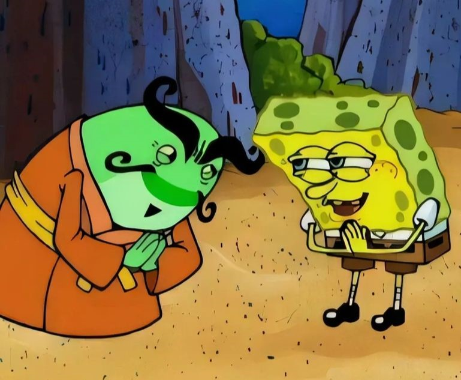

<div align="center">
  <h3>Pemula Coding</h3>
  <p><i><b>Organization Pemula-Coding</b></i>. Di dirikan pada tanggal 22 Agustus 2023</p>
</div>


<br><br>
> **NOTE**: Organisasi ini bersifat freedom.

<details>
<summary>Rules</summary>

  1. Dilarang Bicara Kasar.
  2. Dilarang kirim kontent bebau 18+.
  3. Tidak boleh merendahkan orang lain.
  4. Bertanggung jawab.

</details>

<details>
  <summary>Piagam</summary>
<div align="center">
  
  
</div>
<div align="center">
  
  
</div>
<br>
<div align="center">
  
  
</div>
</details>

<br><br>

## ```Contact```

- <a href="https://chat.whatsapp.com/BjfdmcA9XLWF56iNUMBQtR" rel="nofollow" target="_blank"></a>
- <a href="https://github.com/Pemula-Coding" target="_blank"></a>

<br><br>

## ```Events```
// Belum ada
